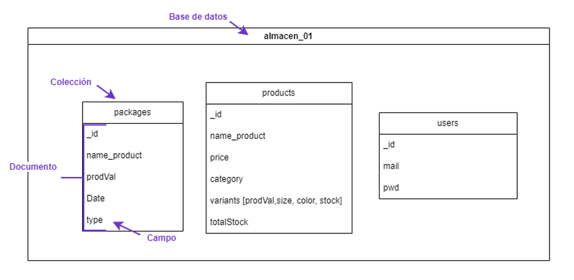
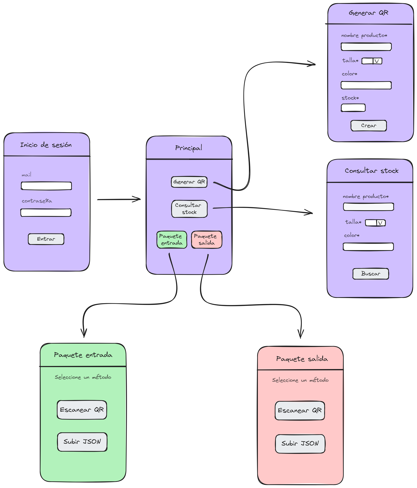

    
   
  
  <h1>SyncStock</h1>
  <b>Automate your inventory, optimize your results.</b>

## <b></b><b> About the Project</b>

 Unlock efficiency in your business with our QR code-powered inventory control system.

### :floppy_disk: Database Schema

This is an example of the schema used to structure the inventory of a clothing company.

 

 

###  :pencil2: UI Sketch

(In progress, not developed yet) Clothing company example.
  

 

### :space_invader: Tech Stack 

 

